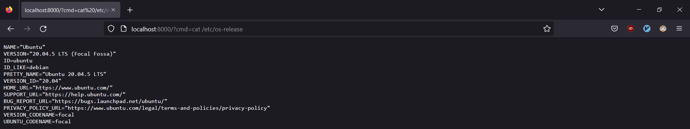

<h1 align='center'>SSJI Web Application</h1>
<h5 align='center'>10/11/2022</h5>



<h3 align="center">Description</h3>

This project aims to demonstrate the SSJI (Server-side JavaScript Injection) vulnerability in [CVE-2014-7205](https://cve.mitre.org/cgi-bin/cvename.cgi?name=CVE-2014-7205). Which opens the possibility of RCE (Remote Code Execution) on a target NodeJS Web Server.  

The repository contains two web applications [simple](./simple/) and `complex`, both showcase the same vulnerability. Written instructions on how to run each app are contained within their respective folders.

Further explanations and steps of how to reproduce the attack, is contained within the `payload` folder together with the javascript payload used.

<h2 align='center'>Prerequisite Instruction</h2>

1. Install the LTS version of [NodeJS](https://nodejs.org/en/)
2. Open Firewall ports 3000 and 8000 for in-bound traffic
3. Launch either `simple` or `complex` as a local server
4. Inject some payloads and have fun

<h2 align="center">Opening Firewall Ports</h2>

### Windows Firewall
```
# Add Rules
netsh advfirewall firewall add rule name="SSJI 3000" dir=in protocl=tcp localport=3000 action=allow
netsh advfirewall firewall add rule name="SSJI 8000" dir=in protocl=tcp localport=8000 action=allow

# Delete Rules 
netsh advfirewall firewall delete rule name="SSJI 3000"
netsh advfirewall firewall delete rule name="SSJI 8000"
```

### Linux IPTables
```
# Add Rules
iptables -I INPUT -p tcp --dport 3000 -j ACCEPT
iptables -I INPUT -p tcp --dport 8000 -j ACCEPT

# Delete Rules
iptables -L --line-numbers
iptables -D INPUT <line number>
```

### Linux NFTables
```
# Add Rules
nft add rule inet filter input tcp dport 3000 accept comment \"allow 3000\"
nft add rule inet filter input tcp dport 8000 accept comment \"allow 8000\"

# Delete Rules
nft -a list ruleset
nft delete rule inet filter input handle <handle number>
```

<div align='center'>
  <h4>technologies used</h4>
  
  
</div>

---

#### sources:
<https://brutelogic.com.br/blog/dom-based-xss-the-3-sinks/>  
<https://exchange.xforce.ibmcloud.com/vulnerabilities/96730>  
<https://portswigger.net/kb/issues/00100d00_server-side-javascript-code-injection>  
<https://s1gnalcha0s.github.io/node/2015/01/31/SSJS-webshell-injection.html>  
<https://www.exploit-db.com/exploits/40689>  
<https://www.openwall.com/lists/oss-security/2014/09/30/10>
