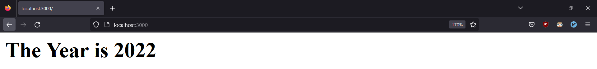

<h1 align='center'>VWA Server-Side JavaScript Injection</h1>
<h5 align='center'>10/11/2022</h5>

<h3 align="center">Description</h3>

This project is a [PoC](https://www.malwarebytes.com/glossary/proof-of-concept) to demonstrate the SSJI vulnerability in [CVE-2014-7205](https://cve.mitre.org/cgi-bin/cvename.cgi?name=CVE-2014-7205), which opens the possibility of RCE (Remote Code Execution) on a target NodeJS Web Server.  

The repository contains two web applications [*what-is-the-year*](./what-is-the-year/) and [*the-cutlery-shop*](./the-cutlery-shop/), both showcase the same vulnerability. Written instructions on how to run each app are contained within their respective folders.

Further explanations and steps of how to reproduce the attack, is contained within the [*payload*](./payload) folder together with the JavaScript payload used.

---

<h5 align='center'>The Cutlery Shop</h5>

<h5 align='center'>What is the year?</h5>

  <h4>technologies used</h4>
  
  

---

#### sources:
<https://brutelogic.com.br/blog/dom-based-xss-the-3-sinks/>  
<https://exchange.xforce.ibmcloud.com/vulnerabilities/96730>  
<https://portswigger.net/kb/issues/00100d00_server-side-javascript-code-injection>  
<https://s1gnalcha0s.github.io/node/2015/01/31/SSJS-webshell-injection.html>  
<https://www.exploit-db.com/exploits/40689>  
<https://www.openwall.com/lists/oss-security/2014/09/30/10>
