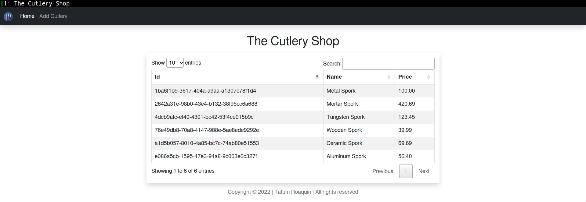

<h1 align='center'>The Cutlery Shop</h1>
<h5 align='center'>12/11/2022</h5>



<h3 align='center'>Description</h3>

This is a vulnerable NodeJS frontend is made to demonstrate the Server-side JavaScript Code Injection vulnerabilty.

<h3 align='center'>How to Run</h3>

1. `npm install`
2. `npm start`

<h3 align='center'>Intended Usage</h3>

The Cutlery Shop is a mock JSON database which stores information about silveware products. You can do the basic __CRUD (Create, Read, Update, Delete)__ operations on that data. Which means populating the form fields provided with the correct data and sending it via __POST__ request.

<h3 align='center'>Exploitation</h3>

JavaScript code can be injected inside the form fields directly, you MUST enclose in two pluses wrapped in double quotations like so:
```
1. " + res.send("hello world") + "
2. " + <payload> + "
```
